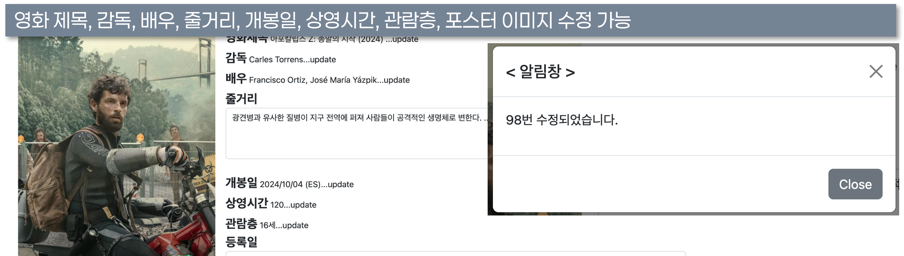
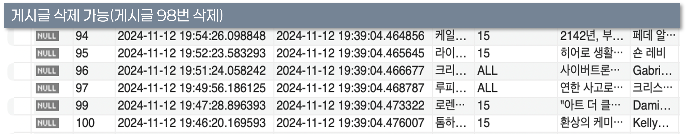
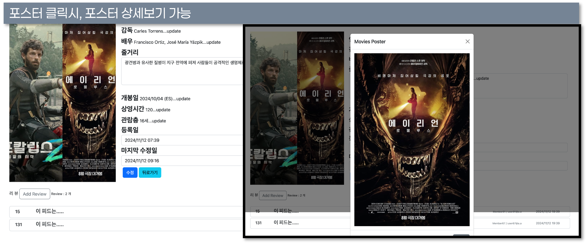

# 🎬 FilmCritiq - 영화 리뷰 및 사진 관리 시스템

> **한눈에 보는 프로젝트 요약**  
> 개인 프로젝트로 개발한 **영화 리뷰 및 사진 관리 시스템**입니다.  
> Spring Boot + Spring Security 기반으로 **영화 CRUD, 리뷰 작성/관리, 이미지 업로드, 권한 제어** 기능을 구현했습니다.  
> DB 설계부터 백엔드/프론트엔드/보안까지 혼자 개발한 풀스택 프로젝트입니다.  

## 프로젝트 개요 &  기술 스택 &  주요 기능

| 구분             | 내용                                                                 |
|------------------|----------------------------------------------------------------------|
| **프로젝트 개요** | 프로젝트 명: FilmCritiq (영화 리뷰 및 사진 관리 시스템) 개발 기간: 2024.08.16 ~ 2024.09.01 개발 환경: IntelliJ, Spring Boot, Spring Security, Maven, MySQL, MariaDB 개발 인원: 1명 (개인 프로젝트) |
| **프로젝트 목적** | 영화 정보 CRUD 리뷰 작성 및 관리 이미지 업로드 처리 회원 인증 및 권한 관리 |
| **기술 스택**     | Java 17 Spring Boot, Spring Security MySQL, MariaDB Maven Thymeleaf, Bootstrap (반응형 UI) JPA, Lombok, DTO/Entity 매핑 |

## 내가 구현한 주요 기능

| 구분            | 구현 내용 |
|-----------------|-----------------------------------------------------------------------------------------------------------------------------------|
| 🎬 영화 관리    | - 영화 등록/수정/삭제/조회 기능 전체 구현 - 페이징 처리 및 검색 기능 적용 (`PageResultDTO` 활용) - Thymeleaf 기반 영화 상세/리스트 UI 작성 |
| 📝 리뷰 시스템  | - 리뷰 등록, 수정, 삭제 기능 (작성자 본인만 수정/삭제 가능) - 리뷰-영화-회원(Entity) 연관관계 매핑 - Ajax 기반 비동기 댓글 처리 |
| 🖼 이미지 관리  | - 단일 및 다중 이미지 업로드 (`MultipartFile`) - 날짜/UUID 기반 디렉토리 관리 - 기본 이미지 표시 기능 - 상세 페이지 이미지 추가/삭제 가능 |
| 🔐 인증·권한 관리 | - Spring Security 로그인/로그아웃 구현 - 사용자 권한에 따른 접근 제어 (`USER`, `MANAGER`, `ADMIN`) - 로그인 상태별 동적 메뉴 처리 |
| 📂 DB 설계/매핑 | - `Movies`, `Reviews`, `Photos`, `ClubMember` 등 Entity 설계 - DTO ↔ Entity 매핑 구조화 - ERD 기반 테이블 관계 설정 |
| 💻 UI/UX       | - Bootstrap 기반 반응형 레이아웃 구현 - 로그인, 영화 목록, 리뷰 작성/수정 모달 UI 개발 - 입력 유효성 검사 및 알림창 구현 |

## 서비스 시연 화면

<table>
  <tr>
    <td align="center">로그인 페이지</td>
    <td align="center">로그인 유효성 검사</td>
  </tr>
  <tr>
    <td></td>
    <td></td>
  </tr>
</table>

<table>
  <tr>
    <td align="center">영화 목록</td>
    <td align="center">영화 등록</td>
    <td align="center">다중 이미지 등록</td>
  </tr>
  <tr>
    <td></td>
    <td></td>
    <td></td>
  </tr>
</table>

<table>
  <tr>
    <td align="center">영화 상세 페이지</td>
    <td align="center">대체 이미지</td>
    <td align="center">이미지 추가/삭제</td>
  </tr>
  <tr>
    <td></td>
    <td></td>
    <td></td>
  </tr>
</table>

<table>
  <tr>
    <td align="center">리뷰 등록</td>
    <td align="center">리뷰 수정</td>
    <td align="center">리뷰 삭제</td>
  </tr>
  <tr>
    <td></td>
    <td></td>
    <td></td>
  </tr>
</table>

<table>
  <tr>
    <td align="center">영화 수정</td>
    <td align="center">게시글 삭제</td>
    <td align="center">포스터 상세보기</td>
  </tr>
  <tr>
    <td></td>
    <td></td>
    <td></td>
  </tr>
</table>

<table>
  <tr>
    <td align="center">영화 상세 + 리뷰 리스트</td>
    <td align="center">리뷰 DB 관리</td>
  </tr>
  <tr>
    <td></td>
    <td></td>
  </tr>
</table>

---

