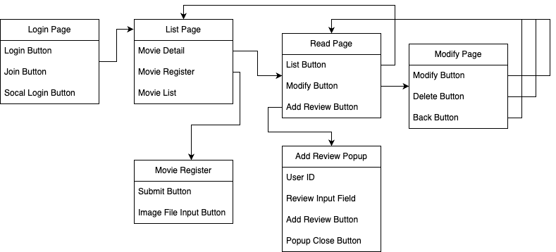

# 🎬 FilmCritiq - 영화 리뷰 및 사진 관리 시스템

[👉 GitHub Repository](https://github.com/JISUSAMA/FilmCritiq) 

---

## 1. 📖 프로젝트 개요

* **프로젝트 명**: FilmCritiq (영화 리뷰 및 사진 관리 시스템)
* **개발 기간**: 2024.08.16 ~ 2024.09.01
* **개발 환경**: IntelliJ, Spring Boot, Spring Security, Maven, MySQL, MariaDB
* **개발 인원**: 1명 (개인 프로젝트)

**주요 목적**

* 영화 정보 CRUD
* 리뷰 작성 및 관리
* 이미지 업로드 처리
* 회원 인증 및 권한 관리

---

## 2. 🔧 기술 스택

* **Language**: Java 17
* **Framework**: Spring Boot, Spring Security
* **Database**: MySQL, MariaDB
* **Build Tool**: Maven
* **Front**: Thymeleaf, Bootstrap (반응형 UI)
* **Etc**: JPA, Lombok, DTO/Entity 매핑

---

## 3. 🏛 시스템 아키텍처

```
[Client] ──▶ [Controller] ──▶ [Service] ──▶ [Repository] ──▶ [Database]
                        │             │
                 [DTO ↔ Entity Mapper]│
                               └──▶ [File System (Image Upload)]
```

---

## 4. 📌 주요 기능 및 API

### 4.1 영화 관리

* 영화 등록, 목록 조회(페이징), 상세 보기, 수정, 삭제

### 4.2 리뷰 관리

* 리뷰 등록, 수정, 삭제 (본인 리뷰만 가능)

### 4.3 이미지 업로드

* 단일 및 다중 이미지 업로드 가능
* 이미지 없을 경우 기본 이미지 표시

### 4.4 인증 및 회원 관리

* Spring Security 기반 권한 관리 (`USER`, `MANAGER`, `ADMIN`)
* 로그인 상태에 따라 기능 접근 제어

---

## 5. 🗂 데이터 모델

```java
class Movies {
  Long mno;
  String title;
  String director;
  List<Photos> photos;
  List<Reviews> reviews;
}

class Reviews {
  Long reviewnum;
  String text;
  int grade;
  ClubMember member;
  Movies movie;
}

class Photos {
  String uuid;
  String fileName;
  boolean img;
  Movies movie;
}
```

---

## 6. 📸 서비스 시연 화면

| 로그인 페이지                     | 로그인 유효성 검사                   |
| --------------------------- | ---------------------------- |
|  |  |

| 영화 목록                      | 영화 등록                      | 다중 이미지 등록                     |
| -------------------------- | -------------------------- | ----------------------------- |
|  |  |  |

| 영화 상세 페이지                  | 대체 이미지                     | 이미지 추가/삭제                   |
| -------------------------- | -------------------------- | --------------------------- |
|  |  |  |

| 리뷰 등록                         | 리뷰 수정                         | 리뷰 삭제                         |
| ----------------------------- | ----------------------------- | ----------------------------- |
|  |  |  |

| 리뷰 전체 관리                        | 리뷰 권한 제어                       | 리뷰 DB 반영                   |
| ------------------------------- | ------------------------------ | -------------------------- |
|  |  |  |

| 영화 수정                      | 게시글 삭제                        | 포스터 상세보기                     |
| -------------------------- | ----------------------------- | ---------------------------- |
|  |  |  |

| 영화 상세 + 리뷰 리스트                 | 리뷰 DB 관리                      |
| ------------------------------ | ----------------------------- |
|  |  |

---

## 7. 🔮 확장 계획

| 항목         | 설명                             |
| ---------- | ------------------------------ |
| JWT 인증 도입  | Spring Security + JWT 기반 인증 개선 |
| Swagger 적용 | API 문서 자동화                     |
| 추천 기능      | 영화 추천 및 리뷰 기반 알고리즘 추가          |

---

## 8. 🎯 핵심 성과

* **Spring Boot + Security + 이미지 업로드**까지 단일 프로젝트 내 구현
* DTO/Entity 분리 및 `PageResultDTO` 적용으로 **페이징 처리 효율화**
* 권한별 접근 제어를 통한 **Admin / User 기능 차별화**
* 다중 이미지 등록 및 대체 이미지 기능으로 **사용자 경험 개선**
